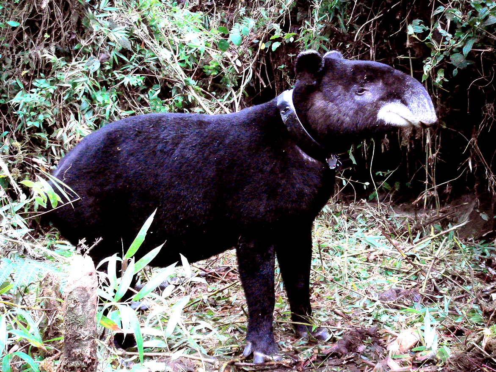

```{r setup, include=FALSE}
knitr::opts_chunk$set(echo = TRUE, message = FALSE, 
                      cache = FALSE, warning = FALSE, las = 1, dpi = 200)
```

```{r colsFunction, eval = FALSE}
xaringan::inf_mr()
```

```{r xaringan-extras, echo=FALSE}
xaringanExtra::use_tile_view()
```


# Movement Data

.pull-left.large[
At a minimum contain three columns: 

- `X`, `Y`, `Time`

But - unless there is only one of your animal in the world - also:

- `ID`

Simple!
]

--

.pull-right.large[

**But**, in practice, there are always problems & complications.   Even with just three columns:

- `Time` - crazy complicated data formatting 
- `X` and `Y` - have to be **geo-referenced**

]

--
.center.large[
.red[Data always needs to be **processed** (cleaned up).  

Nobody enjoys this!  It is **tedious** and **time-consuming**.  

But also very important.]
]

---

## Principles of data processing

### Smart data processing is:

- **compartamentalized** - e.g. each step a function

- **interactive** - use visualization and interactive tools

- **generalizable** - to apply to multiple individuals / multiple populations

- **replicable** - *important: NEVER overwrite the raw data!*

- **well-documented** - so you don't have to remember what you did

- **forgettable!** - so once its done you don't need to think about it any more


---

##  Some Tools

Several packages and `Rtools` particularly useful for data processing and clean-up:

- `plyr` - manipulating data frames and lists
 - functions: `mutate()`; `ddply()`-`ldply()`-`dlply()`

- `lubridate` - manipulating time objects

- `sf` - projecting coordinates

- `maps` and `mapdata` - quick and easy maps

- `magrittr` (or - now - the **native pipe**).


---

.pull-left[

## Example: Mountain Tapirs 


*Tapirus pinchaque*
- Anta da montanha
- Tapir andino
- Sacha huagra
]

.pull-right[


.pull-right-40[

.blue[gracias Diego!]
]]


---

## Loadinc csv's is easy!

```{r LoadTapir1, echo = 2, eval = TRUE}
setwd("../../_ignore/tapir")
tapir1 <- read.csv("tapir1.csv")
head(tapir1)
```

**what is this!?**

--

Try tapir 2:

```{r LoadTapir2, echo = 2, eval = TRUE}
setwd("../../_ignore/tapir")
tapir2 <- read.table("tapir2.csv")
head(tapir2)
```

**what is going on here!?!?**


---
.pull-left-70[
## Complete processing of raw tapir data

1. Fixes formatting
2. Fixes times
3. Combines
4. Gives spatial projection
5. Saves
```{r, echo = -1}
setwd("../../_ignore/tapir")
require(lubridate); require(plyr); require(sf); require(mapview)
tapir <- rbind(
  read.table("tapir1.csv", sep = "\t", header = TRUE) |>
  mutate(ID = "Tapir1", Date = ymd(Date)),
  read.table("tapir2.csv", sep = "\t", header = TRUE) |>
  mutate(ID = "Tapir2", Date = dmy(Date)),
  read.table("tapir3.csv", sep = "\t", header = TRUE) |>
  mutate(ID = "Tapir3", Date = dmy(Date))) |>
  mutate(Time = ymd_hms(paste(Date, Time))) |> 
  st_as_sf(coords = c("East","North"), crs = 32619)

save(tapir, file = "tapir.rda")
```
]

--

.pull-right-30[


**Remember: Every data processing task is as unique and special as an (evil) snowflake!**
]

---

## Where are these tapirs? 

```{r, echo = -1}
setwd("../../_ignore/tapir")
load("tapir.rda")
mapview(tapir, zcol= "ID")
```

]
---

##  Movebank format helps a lot!

```{r, eval = FALSE, echo = TRUE}
require(move)
login <- movebankLogin(username="MyUserName", password="XXXXXX")
tapir.move <- getMovebankData(study="Mountain tapir, Colombia", login=login)
```

```{r, echo = FALSE, eval = TRUE}
load(file = "../../_ignore/tapir/tapir_move.rda")
```


.pull-right-70[]

---

## But even then, you need to to some tidying!

.pull-left[
You probably want a format that doesn't have all of this: 

```{r}
names(tapir.move)
```

So we process to: 
1. extract the columns we want
2. rename them properly
3. project to the same geometry as the first data
4. combine together
]


--

.pull-right[

```{r}
tapir2 <- tapir.move[,c("tag_id", "timestamp", 
                    "location_long", "location_lat")] |>
            plyr::rename(c(timestamp = "Time")) |>
            st_as_sf() |> 
            mutate(ID = paste0("Tapir", as.integer(factor(tag_id)) + 3)) |> 
  st_transform(st_crs(tapir))

tapir_all <- rbind.fill(tapir, tapir2) |> st_as_sf()
```
]


---

### Where were these tapirs?

```{r, fig.width = 6}
mapview(tapir_all, zcol = "ID")
```


---

##  Now we practice ...

.pull-left[

### Elk (*Cervus elaphus*)


]

.pull-right[
near Banff National Park 


]
