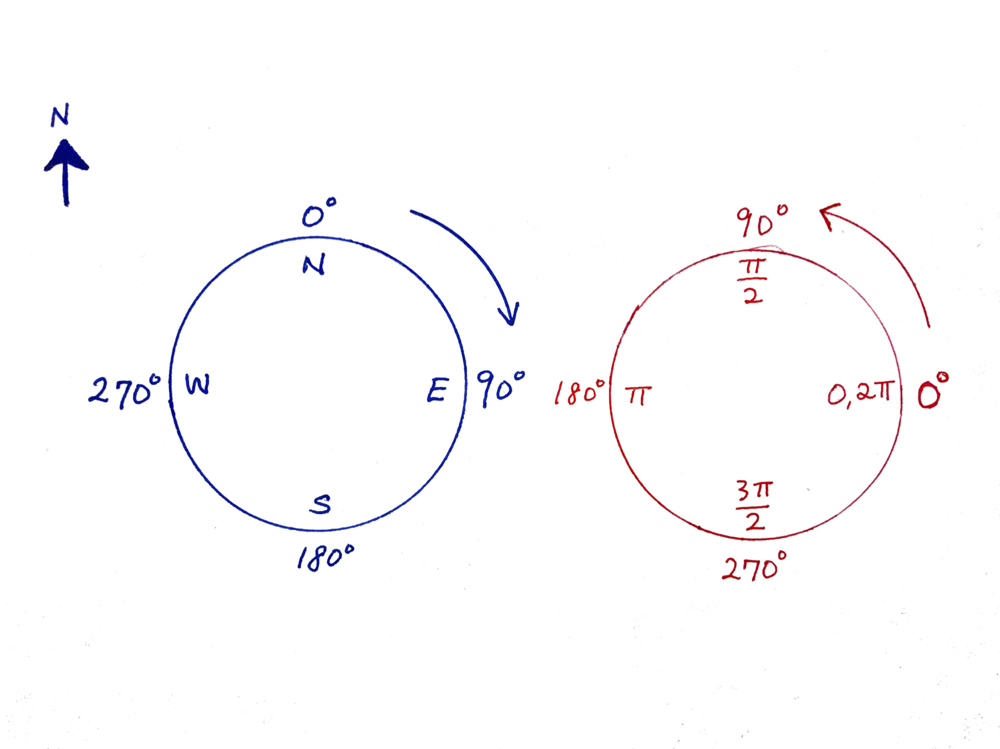
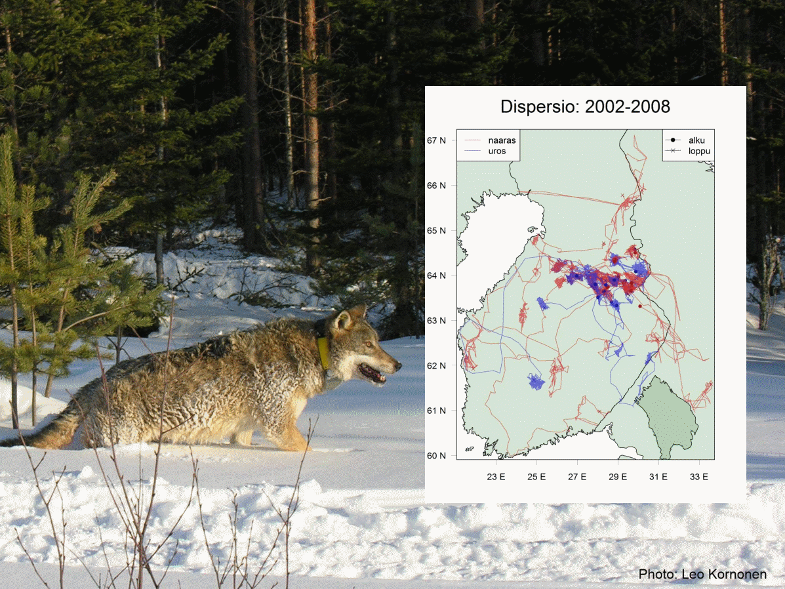
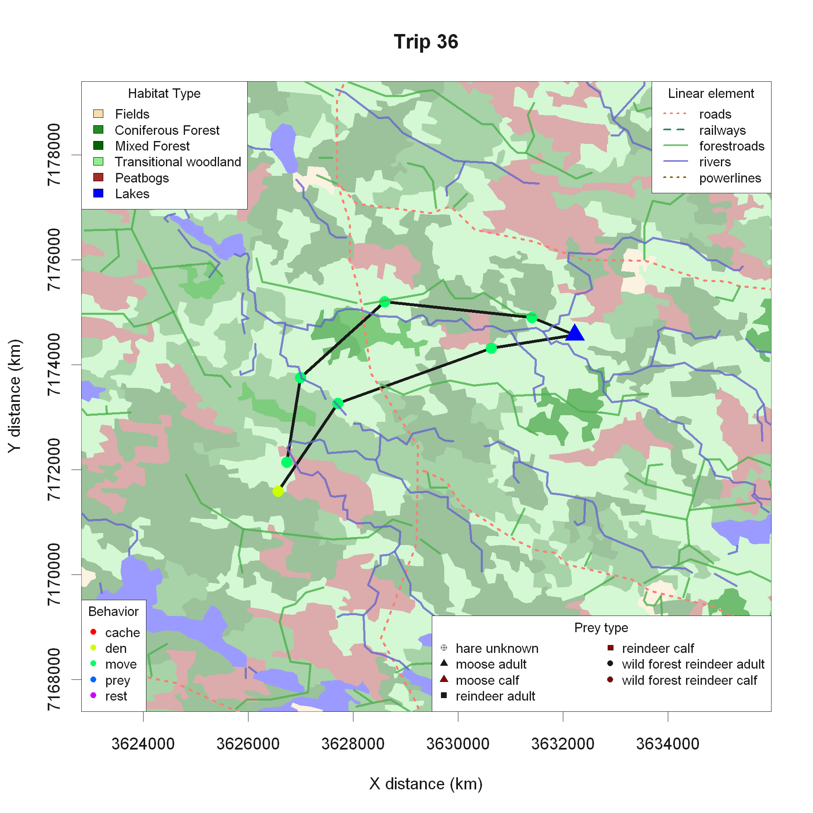
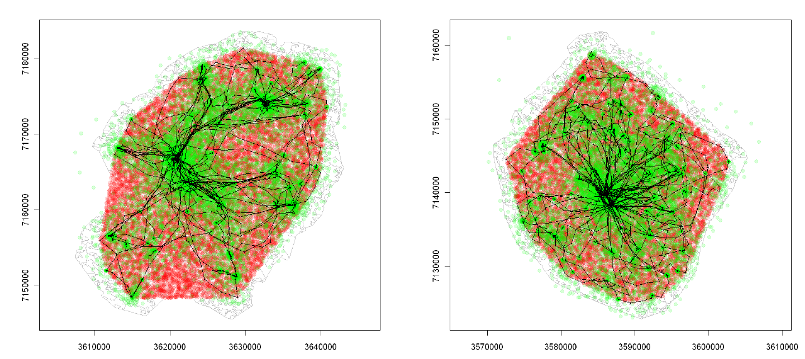
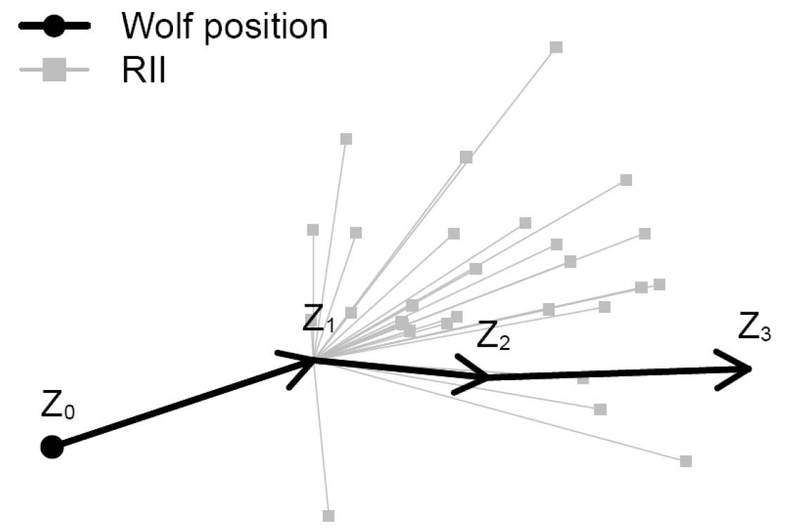
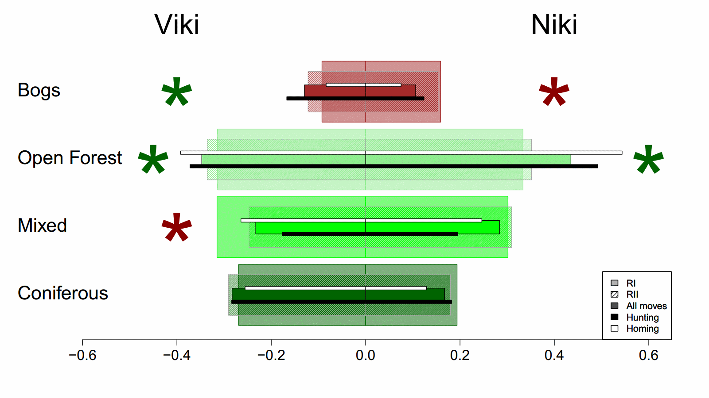
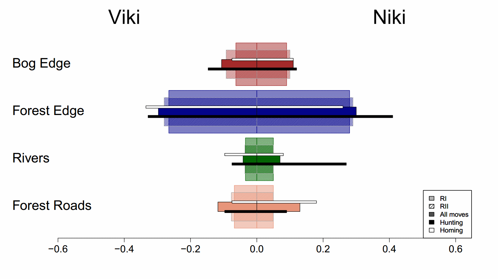

```{r setup, include=FALSE}
knitr::opts_chunk$set(echo = TRUE, message = FALSE, 
                      fig.height=4, fig.width = 6,
                      cache = FALSE, warning = FALSE, 
                      las = 1, dpi = 200)
#output: html_document
```

```{r colsFunction, eval = FALSE}
xaringan::inf_mr()
```


```{r echo = FALSE}
pcks <- c("fields", "gplots", "scales")
a <- sapply(pcks, require, character = TRUE)
```


.pull-left[

## Why complex numbers? 

> The  **most efficient way** to deal with 2D vectors, both in .red[math] and in .blue[R code]. 

> They are simple!
]

--

.pull-right[

## What is a complex number? 

$$ Z = X + iY $$

- $X$ is the **real** part.  
- $Y$ is the **imaginary** part.

The same number can be written:

$$ Z = R \exp(i \theta) $$
- $R$ is the length of the vector: the **modulus**
- $\theta$ is the orientation of the vector: the **argument**
]

---


.pull-left-30[
## An example

```{r makeZ, tidy=FALSE, echo = TRUE}
X <- c(3,4,-2)
Y <- c(0,3,2)
Z <- X + 1i*Y
Z
```
Alternatively: 
```{r}
Z <- complex(re = X, im=Y)
```

```{r, eval = FALSE}
plot(Z, asp = 1)
```
]

.pull-right-70[

```{r plotZ, dpi=300, echo=FALSE}
par(bty="l", cex.lab=1)
cols <- c("darkblue", "darkred", "darkorange")
plot(Z, pch=19, col=NA, asp=1)
points(0,0,pch = 19)
for(i in 1:length(Z))
text(Re(Z[i]), Im(Z[i]), bquote(Z[.(i)]), col = cols[i], pos = 4, xpd = NA, font = 2, cex = 1.5)
arrows(rep(0,length(Z)), rep(0,length(Z)), Re(Z), Im(Z), lwd=2, col=cols, 
      length = .15)
```
]

> .darkred[**Note:** ALWAYS use `asp=1` - (aspect ratio = 1:1) - when plotting (properly projected) movement data!]

---

## Obtaining summary statistics

.pull-left[

Obtain lengths of vectors - **modulus** `Mod()`:
```{r echo = TRUE}
Mod(Z)
```

Obtain orientation of vectors - **argument** `Arg()`

```{r}
Arg(Z)
```

Note  orientations are in radians, i.e. range from $0$ to $2\pi$ going **counter-clockwise** from the $x$-axis.  Compass directions go from 0 to 360  **clockwise**.  
]

.pull-right[

To convert **radians** to **compass direction**:
```{r}
90-(Arg(Z)*180)/pi
```


.small.center[(image: [Wilson Ding](https://wilsonding.com/2018/07/15/converting_compass_degrees_to_radians/))]

]

---


.pull-left[

## Lets play with a trajectory

Quick code for a **correlated random walk** (CRW):

```{r SRW, tidy=FALSE, echo = -1}
set.seed(1976)
X <- cumsum(arima.sim(n=1000, model=list(ar=.9)))
Y <- cumsum(arima.sim(n=1000, model=list(ar=.9)))
Z <- X + 1i*Y
```
]

.pull-right[
```{r, fig.height = 6, fig.width= 6}
plot(Z, type="o", asp=1)
```
]

---

.pull-left[
## Instant summary statistics:

The average location
```{r echo = TRUE}
mean(Z)
```
]

.pull-right[
The step vectors (first 100):


```{r, fig.height = 6, fig.width= 6}
dZ <- diff(Z)
plot(dZ[1:100], asp=1, type="n")
arrows(rep(0, 100), rep(0, 10), Re(dZ[1:100]), Im(dZ[1:100]), col=rgb(0,0,0,.5), lwd=2, length=0.1)
```
]

---

## Distribution of step lengths

.pull-left[
```{r}
S <- Mod(dZ)
summary(S)
```
]

.pull-right[
```{r, fig.height = 6}
hist(S, col="grey", bor="darkgrey", freq=FALSE)
```
]

---


## What about angles?

.pull-left[

#### The absolute orientations:

```{r, echo=2}
par(bty="l", xpd=TRUE)
Phi <- Arg(dZ)
hist(Phi, col="grey", bor="darkgrey", freq=FALSE, breaks=20)
```
]

.pull-right[

#### Turning angles
```{r, echo=2}
par(bty="l", xpd=TRUE)
Theta <- diff(Phi)
hist(Theta, col="grey", bor="darkgrey", freq=FALSE, breaks=20)
```

]

.center[**<font color="blue"> QUESTION: What is a problem with these histograms?</font>**]

---

## Circular statistics
.pull-left-40[
Angles are a **wrapped continuous variable**, i.e. $180^o > 0^o = 360^o < 180^o$. The best way to visualize the distribution of wrapped variables is with **Rose-Diagrams**.  An R package that deals with circular data is `circular`. 
]

.pull-right-60[
```{r, message=FALSE, warning=FALSE, echo=TRUE, eval = FALSE}
par(mfrow=c(1,2))
require(circular)
rose.diag(Phi, bins=24); rose.diag(Theta, bins=24)
```

```{r, echo = FALSE, fig.width = 6, fig.height = 3}
par(mfrow=c(1,2), mar = c(0,0,3,0)); require(circular)
rose.diag(Phi, bins=16, col="grey", prop=2, main=expression(Phi))
rose.diag(Theta, bins=16, col="grey", prop=2, main=expression(Theta))
```
]

---

## LAB EXERCISE

.large[
> 1. Load movement data of choice!

> 2. Convert the locations to a complex variable Z.

> 3. Obtain a vector of time stamps T, draw a histogram of the time intervals. Then, ignore those differences. 

> 4. Obtain, summarize and illustrate:
>
> -  the step lengths 
> -  the absolute orientation
> -  the turning angles
]


---

## Relevent code snippets


If `X` and `Y` are coordinates is a track in complex coordinates and `Time` is a POSIX time object:

```{r, eval = FALSE}
Z <- X + 1i*Y
Steps <- diff(Z)
StepLengths <- Mod(Steps)
Orientation <- Arg(Steps)
TurningAngles <- diff(Orientation)
TotalDistance <- sum(StepLengths)
TimeIntervals <- diff(Time, units = "hours")
```


And some summary statistics

```{r, eval = FALSE}
ClusteringCoefficient <- mean(cos(TurningAngles))
MeanFixRate <- mean(TimeIntervals)
```


---

## Complex manipulations (are easy)

.pull-left[


### Addition and subtraction of vectors: 

$$ Z_1 = X_1 + i Y_1$$ 
$$Z_2 = X_2 + i Y_2$$
$$ Z_1 + Z_2 = (X_1 + X_2) + i(Y_1 + Y_2)$$
]

.pull-right[
Useful for shifting locations:

```{r, echo=-1}
par(xpd=FALSE, bty="l", mar = c(2,2,2,2), mar = c(2,2,2,2)); Z <- Z[1:100]
plot(Z, asp=1, type="l", col="darkgrey", xlim=c(-1,1)*max(Mod(Z)))
lines(Z - 30, col="red", lwd=2) # left by 30
lines(Z + 40, col="blue", lwd=2) # right by 50
lines(Z + 20i, col="orange", lwd=2) # up by 100
```
]

---


.pull-left[
## Complex manipulations (are easy)

### Multiplication of complex vectors
$$ Z_1 = R_1 \exp(i \theta_1)$$ 
$$Z_2 = R_2 \exp(i \theta_2)$$
$$ Z_1 \times Z_2 = R_1 R_2 \, \exp \, (i\,(\theta_1 + \theta_2))$$

So multiplication *rotates* by $\text{Arg}(Z_2)$, and *stretches* by $\text{Mod}(Z_2)$.  If $\text{Mod}(Z_2) = 1$, then this is "pure rotation". 
]

.pull-right[

```{r, echo=-1, fig.height = 4, fig.width = 6}
par(xpd=TRUE, bty="l", mgp = c(1,.25,0), tck = 0.01, las = 1)
# counterclockwise by pi/2 = 90 degrees
Rot1 <- complex(mod=1, arg=pi/2) 
# clockwidth by pi/6 = 30 degrees
Rot2 <- complex(mod=1, arg=-pi/6) 

plot(c(0,Z), asp=1, type="l", col="darkgrey", lwd=3, xlim = max(Mod(Z)) * c(-1,1))
lines(c(0,Z*Rot1), col="darkred", lwd=2)
lines(c(0,Z*Rot2), col="blue", lwd=2)
lines(c(0,Z*Rot2*Rot2), col="darkblue", lwd=2)
```
]

---

## A colorful loop:

.pull-left[
```{r, eval=FALSE}
require(gplots)
plot(Z, asp=1, type="n", xlim=c(-1,1)*max(Mod(Z)), ylim=c(-1,1)*max(Mod(Z)))
cols <- rich.colors(length(Z),alpha=0.1)
thetas <- seq(0,2*pi,length=length(Z))
for(i in 1:1000)
  lines(Z*complex(mod=1, arg=thetas[i]), col=cols[i], lwd=4)
```
]

.pull-right[
```{r SillyRainbow, echo=FALSE, fig.height = 6, fig.width = 6}
require(gplots)
plot(Z[1:100], asp=1, type="n", xlim=c(-1,1)*max(Mod(Z)), ylim=c(-1,1)*max(Mod(Z)))
cols <- rich.colors(100,alpha=0.4)
thetas <- seq(0,2*pi,length=100)
for(i in 1:100)
  lines(Z*complex(mod=1, arg=thetas[i]), col=cols[i], lwd=4)
```
]

--

## Ok, very pretty rainbow ... **but why!?**

--

.darkred[**Very useful for generating snull sets for pseudo-absences!!**]


---


### Example with Finnish Wolves
.pull-left[


In-depth summer predation study, questions related to habitat use 

 * landscape type  - forest/bog/field
 * linear elements  - roads/rivers/power lines, etc.
 
]

.pull-right[

]


---


## Defining Null Sets

.pull-left.large[

1. Obtain all the steps and turning angles

2. Rotate them by the orientation of the last step: $Arg(Z_1-Z_0)$ 

3. Add the rotated steps to the last step: $Z_1$ 



]


.pull-right[


]


---


.pull-left[

## Calculating Null Sets in .blue[**R**]

.red[`1.` Obtain all the steps and turning angles]

```{r}
Z <- Z[1:10]
n <- length(Z)
S <- Mod(diff(Z))
Phi <- Arg(diff(Z))
Theta <- diff(Phi)
RelSteps <- complex(mod = S[-1], arg=Theta)
```

.red[`2.` Rotate them by the orientation of the last step: $Arg(Z_1-Z_0)$]

```{r}
Z0 <- Z[-((n-1):n)]
Z1 <- Z[-c(1,n)]
Z2 <- Z[-(1:2)]

Rotate <- complex(mod = 1, arg=Arg(Z1-Z0))
```
]

.pull-right[

```{r, echo=-1, fig.width = 5, fig.height = 5}
par(bty="l", axis=FALSE)
plot(c(0,RelSteps), asp=1, xlab="x", ylab="y", pch=19)
arrows(rep(0,n-2), rep(0, n-2), Re(RelSteps), Im(RelSteps), col="darkgrey")
```

> Note: in practice (i.e. with tons of data), it is enough to randomly sample some smaller number (e.g. **30**) null steps at each location.
]


---

.pull-left[
## Fuzzy catterpillar plot

<font color="red">
3. Add the rotated steps to the last step
</font>

```{r, eval=TRUE}
Z.null <- matrix(0, ncol=n-2, nrow=n-2)
for(i in 1:length(Z1))
  Z.null[i,] <- Z1[i] + RelSteps * Rotate[i]
```

<font color="red">
4. Make the fuzzy catterpillar plot
</font>
```{r eval = FALSE}
palette(rich.colors(10))
plot(Z, type="o", col=1:10, pch=19, asp=1)
for(i in 1:nrow(Z.null))
  segments(rep(Re(Z1[i]), n-2), rep(Im(Z1[i]), n-2), s
           Re(Z.null[i,]), Im(Z.null[i,]), col=i+1)
```
]

.pull-right[

```{r, echo=FALSE, fig.height=8}
par(bty="l", axes=FALSE)
palette(rich.colors(10))

plot(Z, type="o", col=1:10, pch=19, asp=1)
for(i in 1:nrow(Z.null))
  segments(rep(Re(Z1[i]), n-2), rep(Im(Z1[i]), n-2), 
           Re(Z.null[i,]), Im(Z.null[i,]), col=i+1)
```
]

---

.pull-left[
## Using the null-set

The use of the null set is a way to test a narrower null hypothesis that accounts for auto correlation in the data.  

The places the animal COULD HAVE but DID NOT go to are *pseudo-absences*, against which you can fit, e.g., logistic regression models (aka **Step-selection functions**).

Or just be simple and compare observed locations with Chi-squared tests:
]

.pull-right[


]

