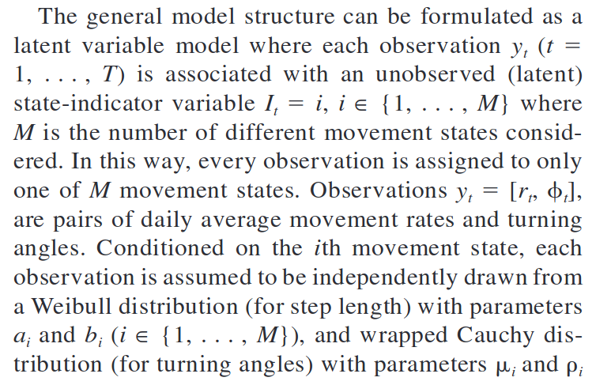
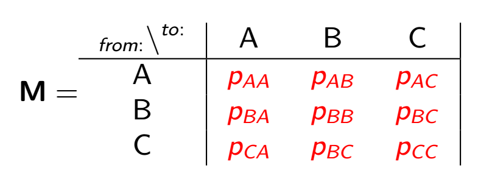

```{r setup, include=FALSE}
knitr::opts_chunk$set(echo = TRUE, message = FALSE, 
                      fig.height=4, fig.width = 6,
                      cache = FALSE, warning = FALSE, 
                      las = 1, dpi = 200)
#output: html_document
```

```{r colsFunction, eval = FALSE, echo = FALSE}
xaringan::inf_mr()
```

```{r, echo = FALSE, message = FALSE}
require(elieslides)
require(marcher)
require(circular)
scantrack <-  function(Z, ...){
  scan_track(data.frame(T = 1:length(Z), X = Re(Z), Y = Im(Z)), ...)
}
```


## 1D Random Walk
.pull-left[
$$X \sim \text{RW}_{1d}(\sigma)$$

$$X_t = X_{t+1} + \sigma W_t$$
where $W_t \sim {\cal N}(0,1)$ = white noise

```{r, echo = TRUE}
sigma = 2
Z <- cumsum(rnorm(100, sd = sigma))
```
]
.pull-right[
```{r, echo = FALSE, fig.height = 5}
pars()
plot(1:length(Z), Z, type = "o", xlab = "time")
```
]

<!-- --- -->

<!-- ### Properties -->

<!-- $$\text{E}(Z_t) = 0$$ -->
<!-- $$\text{Var}(Z_t) = \sigma^2 t$$ -->
<!-- On *average* goes nowhere, over time goes to $\infty$ (unconstrained) -->

---

## 2D Random Walk

.pull-left[
$${\bf Z} \sim \text{RW}_{2d}(\sigma)$$ 
$${\bf Z}_t = {\bf Z}_{t-1} + \sigma{\bf W}_t$$

boldfacing means 2-d vector, but will drop going forward.

```{r, echo = TRUE}
sigma <- 3; n <- 100
Z <- cumsum(rnorm(n, sd = sigma)) + 
  1i*cumsum(rnorm(n, sd = sigma))
```
]

.pull-right[
```{r, echo = FALSE, fig.height = 5}
pars()
scantrack(Z, cex = 1)
```
]

---

### Properties
.pull-left[
$$\text{E}({\bf Z}_t) = \{0,0\};\,\, \text{Var}(|{\bf Z}_t|) = 2 \sigma^2 t$$
]

.pull-right[
Step & turning angles:

$$\theta \sim \text{Unif}(-\pi, \pi)$$

$${|\bf S| / \sigma} \sim \text{Chi}(k = 2); \,\,  \text{E}({|\bf S|}) = \sqrt{2}\sigma$$
]

You can use this result to estimate $\sigma$ - take the mean step lengths and divide by $\sqrt{2}$


```{r RW_CRW, echo = FALSE, fig.height = 5, fig.width = 10}
n <- 1000
sd <- 3
Z <- cumsum(rnorm(n, sd = sd)) + 1i*cumsum(rnorm(n, sd = sd))
S <- Mod(diff(Z))
par(mfrow = c(1,2))
hist(S/sd, breaks = 40, freq = FALSE, bor = "darkgrey")
#curve(chi::dchi(x,2), add = TRUE, col = "red", lwd = 2)
rose.diag(diff(Mod(diff(Z))), bins = 24, 
          prop = 2, col = "grey", bor = "darkgrey", 
          main = expression("turning angle"~theta))

```
]


---

.pull-left[
## 1D autoregression process


$$X_t = \phi X_{t+1} +\sigma W_t$$
```{r, echo = FALSE}
sigma = 2; phi = 0.8; n = 100; 
X <- c(rnorm(1,0,sigma), rep(NA, n-1))
for(i in 2:n)
  X[i] <- phi*X[i-1] + rnorm(1,0,sigma)
```

### Properties

$$\text{E}(X_t) = 0$$
$$\text{Var}(X_t) = {\sigma^2 \over 1-\phi^2}  $$
(Auto)-regresses to mean (easily rescaled to $\mu \neq 0$). 

Spatially constrained! 
<!-- By the way: start making functions! -->

```{r, echo = FALSE}
AR1D <- function(n = 100, sigma = 2, phi = 0.8, mu = 0){
  X <- c(rnorm(1,0,sigma), rep(NA, n-1))
  for(i in 2:n)
    X[i] <- phi*X[i-1] + rnorm(1,0,sigma)
  X + mu
}
```

]

.pull-right[
```{r, echo = FALSE, fig.height = 5}
pars()
plot(1:length(X), X, type = "o", xlab = "time")
```
]


---

### the Autocorrelation function

This calculates whether subsection locations at a specific lag depend on prior locations. 

```{r, echo = TRUE, fig.width = 10}
acf(X)
```


---

.pull-left-40[

## 2D autoregressive walk

$${\bf Z} \sim \text{AR}_{2d}(\phi, \sigma)$$
$${\bf Z}_t = \phi {\bf Z}_{t-1} + \sigma {\bf W}_t$$

Where everything is 2D.  And easily scaled to a different mean $\bf m$

```{r, echo = FALSE, fig.height = 3}
AR2D <- function(n = 100, phi = 0, sigma = 1, mu = 0){
  X <- AR1D(n, sigma, phi, Re(mu))
  Y <- AR1D(n, sigma, phi, Im(mu))
  X + 1i*Y
}
```

]

.pull-right-60[

```{r, fig.height = 6, echo = FALSE}
scantrack(AR2D(100, 0.8, 1, 10+1i*5), cex = 1)
```
]


---

.pull-left[
### 2D-AR walk: Properties

Spatially constrained in 2D!  

Actually looks kind of like home ranging. 
In fact, the 95% home-ranging area is:

$$A \approx {6 \pi \sigma^2 \over 1 - \phi^2 }$$
(Where $6 \approx -2\log(\alpha)$, $\alpha = 5\%$)

Rewrite in terms of "steps" (displacements):

$${\bf Z}_t = {\bf Z}_{t-1} - (1-\phi){\bf Z}_{t-1} + \sigma {\bf W}_t$$
$${\bf S}_t = - (1-\phi){\bf Z}_{t-1} + \sigma {\bf W}_t$$

This means that the *step* process itself is NOT stationary / independent, but depends on **absolute location**.  

Specifically, the urge to "go home" is proportional to the distance from home. 

]

--

.pull-right[

And, of course, there is auto-correlation in the locations:

```{r, fig.height = 2.5, echo  = FALSE}
pars()
Z <- AR2D(100, 0.8, 1, 10+1i*5)
acf(Re(Z))
```

But NOT in the steps themselves:

```{r, fig.height = 2.5, echo  = FALSE}
pars()
acf(Re(diff(Z)))
```
]


---

## **Correlated Random Walk**

.pull-left[

Basically:  

$$Z_t = Z_{t-1} + S_t$$

$\theta = \text{Arg}(S) \sim \text{some distribution}$
$|S| \sim \text{some distribution}$


]
.pull-right[
> **The famous one:**


> **The totally forgotten one:**


]


---


## 

.pull-left[
Simulate in **R**

```{r echo = TRUE}
require(circular)

CRW <- function(n = 100, rho=0.8, alpha = 1, beta = 2){
  theta <- rwrappedcauchy(n, rho)
  phi  <- cumsum(theta)
  S <- complex(arg = phi, mod = rweibull(n, alpha, beta))
  cumsum(S)
}
```
Also - flies off to infinity.  

```{r, fig.height = 4, echo = FALSE}
pars()
scantrack(CRW())
```

]

.pull-right[

Also - autocorrelated in position:

```{r, fig.height=3, echo = FALSE}
pars()
acf(Re(Z))
```

but not in steps!

```{r, fig.height=3, echo = FALSE}
pars()
acf(Re(diff(Z)))
```
]


---

.pull-left[

## Multi-state Correlated Random Walk


Pretty self-explanatory!  

> **BUT** ... what is the model of transitioning between these states? 
]

.pull-right[

]


---

## Markov Chains

... model **state transitions**

.pull-left[
Consider ${\bf X} = \{X_1,X_2,X_3, ... , X_n\}$ is in some discrete **state** (A, B or C) with fixed probabilities of transitioning from one state to another:

Sample sequence: ${\bf X} = CCCBBCACCBABCBA ...$.

This is called a **Markov chain**.
]
.pull-right[

]

---

## Probability transition matrix

We express this process in terms of a **Probability Transition** matrix:

.pull-left[	

]

.pull-right[
Such that: 
	$$M_{ij}=\Pr{(X_{t+1} = j | X_t = i)} = p_{ij}$$

Such that: 
	$$\Pr{(X_{t+1} = j)} = \sum_{i=1}^N M_{ij} \Pr{(X_t = i)}$$
Which can be conveniently rewritten in matrix notation as: 
	$$\pi_{t+1} = {\bf M} \times (\pi_{t})^T$$
		
Where $\pi_t$ is the distribution of the system over all states at time $t$. 
]

---

## Back to Multi-state CRW ... 

To simulate a multi-state CRW, first create a transition matrix:

```{r}
M <- rbind(c(0.7,0.2,.1), c(.4,.4,.2), c(0,0.8,0.2))
row.names(M) <- colnames(M) <- c("chilling", "cruising", "huffing")
M
```

Create a vector of simulated states:

```{r, echo = TRUE}
n <- 400
states <- 1:nrow(M)
State <- c(1, rep(NA, n=1))
for(i in 2:n) State[i] <- sample(states, 1, prob=M[State[i-1],])  
State[1:100]
```

---

```{r, fig.height = 1, echo = FALSE, eval = FALSE}
pars(); par(mar = c(2,0,0,0), mgp = c(.5,0,0))
image(State %>% t %>% t, col = c("blue","green","orange"), xaxt = "n", xlab = "time")
```

## Simulated MRW

.pull-left-60[


```{r echo = FALSE}
rhos <- c(0, .5, .9)
betas <- c(.5,3,8)
alphas <- c(1,2,5)

rwc <- function (n, mu, rho) {
  ifelse(rho == 0, 
      runif(length(rho == 0), 0, 2*pi), 
        rcauchy(n, mu, -log(rho)) %% (2 * pi))
}

thetas <- rwc(n, mu= 0, rho = rhos[State])
step_lengths <- rweibull(n, shape = alphas[State], scale = betas[State])

S <- complex(arg = cumsum(thetas), mod = step_lengths)
Z <- cumsum(S)
```


```{r MRW_sim_plot, echo = FALSE, fig.height = 5}
pars(); set.seed(1)
cols <-  c("darkblue","green","orange")
plot(Z, type = "l", col = "darkgrey", asp = 1)
points(Z, col = cols[State], pch = 19, cex = 0.5)
legend("topright", legend = row.names(M), col = cols, pch = 19)
```


]

.pull-right-40[

Stationary state proportions: 

```{r, echo = FALSE}
n <- nrow(M)
a <- rbind((t(M) - diag(n))[-n,], rep(1,n))
b <- c(rep(0,n-1),1)
solve(a, b)
```

Simulated proportions:

```{r}
table(State) |> prop.table()
```
]

---

## Habitat dependent Multi-state random walk

.pull-left[

The actual Morales MRW was more interesting than just transitions ... each transition was modeled as **depending on covariates** ( $\bf X$ ) according to coefficients $\beta$.  

$$p_{12} = {e^{\beta {\bf X}} \over 1 + e^{\beta {\bf X}}}$$

and $p_{11} = 1-p_{12}$.   This sounds crazy complicated, but - with recent technology is - in fact - quite easy to do!
]

.pull-right[

Before, we had to struggle a lot with writing Bayesian Markov Chain Monte Carlo simulators, bu now this is (relatively) easy to do with the  `momentuhmm` package.  

]
