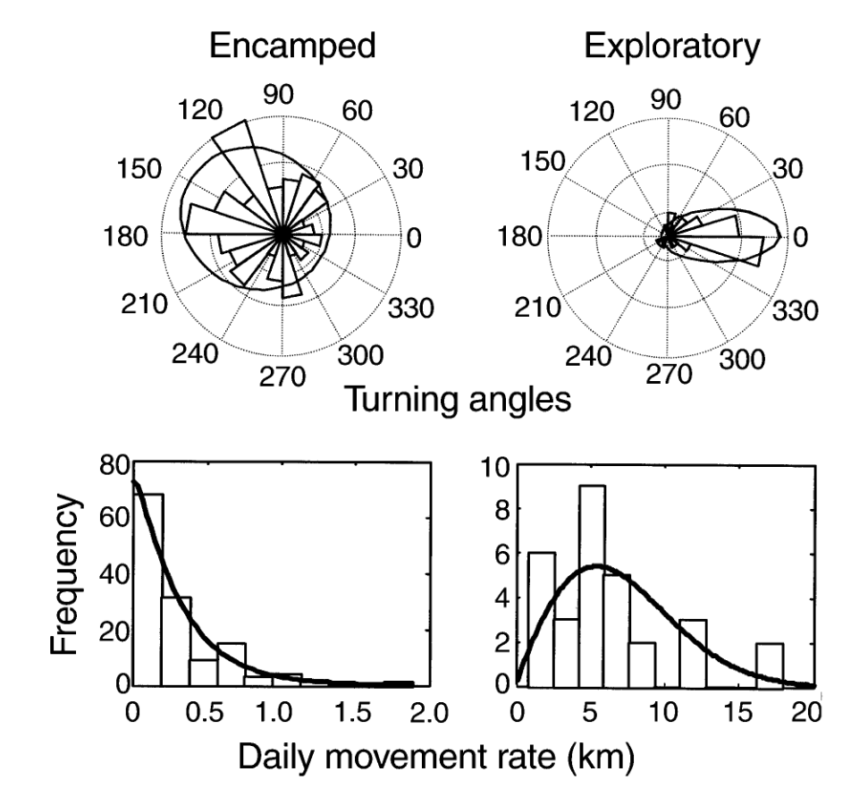

```{r setup, include=FALSE}
knitr::opts_chunk$set(echo = TRUE, message = FALSE, 
                      fig.height=4, fig.width = 6,
                      cache = FALSE, warning = FALSE, 
                      las = 1, dpi = 200)
#output: html_document
```

```{r colsFunction, eval = FALSE, echo = FALSE}
xaringan::inf_mr()
```


# Behaviors are always changing!   

It can be important and interesting to know **where** / **when** / **why**. 

Lots of work has gone into finding where a movement track changes properties.  
This is, broadly, called *segmentation*.  


.pull-left[

]

.pull-right[

]


---

# First Passage Time

.pull-left-40[
 **Spatial and simple**

Asks, how long does it take an animal to leave a particular radius - **at every point**? 


In the `adehabitat` family of packages. 

]


.pull-right-40[]


---

# Lavielle Segmentation


.pull-left-30[

Statisticially find the best division ofa **single time-series** (e.g. speed).

Assumes that the time series is independent Normal with possible change in **mean** and **variance** 

Very nicely implemented in `adehabitatLT` vignette:


]
.pull-right-70[
This is a dolphin track. 


]


---


.pull-left-40[
# Behavioral Change Point Analysis

### Gurarie et al. 2009

Expands on Lavielle by allowing for **irregular data** and **auto-correlation**. 

`bcpa`package

]
.pull-right-60[]

---

# BCPA on Continuous Time Movement Models

Fits actual (continuous time) movement models and finds change points. 

`smoove` package (on GitHub)

]


---

.pull-left-40[
# BCPA on Continuous Time Movement Models

Can do fun things like rotation


]

.pull-right-60[

]


---

.pull-left[

# Multi-state random walks

aka. **State-Space" modeling** or **Hidden Markov Movement Model** 


1. Define pre-fixed number of states, with particular movement parameters for example: 
  - persistence coefficient $\rho$
  - and step-length distribution paramaters $\alpha$ and $\beta$

2. Estimate the **Markov transition probability matrix** 

3. Make predictions from that probability matrix

Lots of examples!  But they are all variations on  **Morales et al. 2004**

]

.pull-right-40[




]


---

.pull-left[

## **Sea Turtles!** movement and diving


States include: 

- **S1**, shallow dives, fast and directed horizontal movement; 
- **S2**, mixture of dive depths, slower and less directed horizontal movement; 
- **S3**, deep dives, intermediate speeds, and partially directed horizontal movement.

 


]

.pull-right-50[


]


---
.pull-left-30[
# Comparing tools


]

.pull-right-70[

]

---
.pull-left-30[
# Comparing tools

]

.pull-right-70[

]
---
.pull-left-30[
# Comparing tools

.Large[A tool **must** know what it is modeling!


> And the "best" tool depends on the **process** you are capturing

]

]

.pull-right-70[

]

