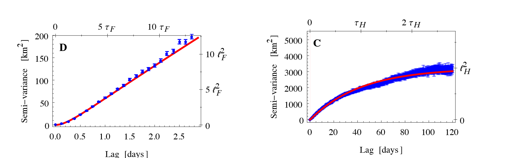
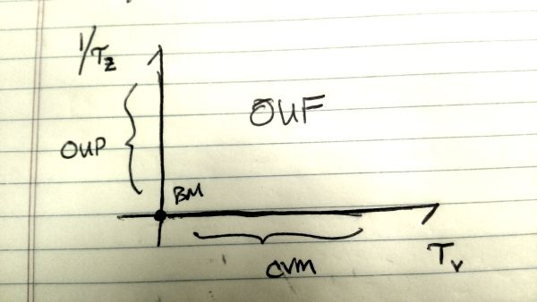

<!--
output: 
  xaringan::moon_reader:
    css: [default, default-fonts, mycss.css]
    nature:
      highlightStyle: github
      countIncrementalSlides: false
      highlightLines: true
      titleSlideClass: ["center"]
      ratio: '16:9'
      
      
output: 
  html_document:
    toc: true
    toc_float: true
    css: "mycss.css"
--> 

```{r setup, include=FALSE}
knitr::opts_chunk$set(echo = FALSE, message = FALSE, cache = TRUE, warning = FALSE, las = 1, dpi = 200)
#output: html_document
```

```{r colsFunction, eval = FALSE}
xaringan::inf_mr()
```

```{r xaringan-scribble, echo=FALSE}
xaringanExtra::use_scribble()
```

```{r xaringan-tile-view, echo=FALSE}
xaringanExtra::use_tile_view()
```

```{r}
require(scales)
require(elieslides)
```


## Auto-correlated kernel density estimates

.pull-left[

`akde` function in the `ctmm` function - gives .red["robust"] and .green["unbiased"] estimates of 95% home range *area* that improves on standard "kernel density estimates" - mainly by:

1. accounting for autocorrelation in movement data
2. providing 95% confidence intervals around the area


> To understand how they work, we have to learn about **Continuous Time Movement Models**
]

.pull-right[


]

---

## Continuous Time Movement Models

.pull-left[
### Advantages

-   Models of locations at **all times** (not just measured times)
-   Naturally robust to irregular data (*all data*!)
-   Parameters and estimates to not depend on sampling scale at all (unlike, e.g,., CRW)
-   Processes can be parameterized in terms of biologically meaningful measures (like *speeds*, *ranging areas*, *time scales*)
]

.pull-right[
### Disadvantages

-   Unfamiliar math (*stochastic partial differential equations*)
-   Hard to estimate
-   Difficult to add structure (e.g. behavioral changes)
-   Contains strong assumptions
]

---

### Fundamental models

.pull-left.large[

1.   White Noise (.red[WN] in `ctmm`)
2.   Brownian Motion (.red[BM] in `ctmm`)
2.   Ornstein-Uhlenbeck Position Process (.red[OU] in `ctmm`)
3.   Correlated Velocity Movement (.red[IOU] in `ctmm`)
4.   .red[OUF] - combines OUP and CVM
]

--

.pull-right.large[

### Derived Metrics

2. home ranges (`akde`)
1. imputation of locations
2. encounters
]


---

## White Noise

.pull-left-40[

**White Noise** is uncorrelated random independent locations.  I.I.D. 

$$ Z(t) = \sigma\,W_t$$
where: 

$W_t$ - is .green[**white noise**], i.e. independent Gaussian process in $X$ and $Y$  ${\cal N}(0, 1)$. 

$\sigma$ - is .blue[**spatial scale of randomness**]

]

.pull-right-60[

```{r BM, tidy=FALSE, fig.height=6, echo = FALSE}
elieslides::pars(); set.seed(2024)
beta <- 3
W <- rnorm(1e3,0,1) + 1i*rnorm(1e3, 0, 1)
Z <- beta*W
plot(Z, asp=1, col=rgb(0,0,0,.5), pch=16, cex=.5)
```

]

---


### Semi-variogram

.pull-left[

This is the **Variance** of the difference between all **pairs of locations** across given **lags**:

$$v(lag) = {1 \over 2}\left(\text{Var}(X_{i+lag} - X_{i}) + \text{Var}(Y_{i+lag} - Y_{i})\right)$$

For white noise it is .blue[0] at lag .blue[0] (all $v(0) = 0$), and then is immediately equal to $2\sigma$:

]


.pull-right[

```{r}
source("functions.R")
elieslides::pars()
T <- seq(1, 100, length = length(Z))
sv <- variogram(Z, T, lag.max = 10)
plot(sv, type = "o")
abline(h= 2*beta, col = 2, lwd = 2)
```


]


---

## Brownian Motion 

.pull-left-40[

Position is the integral of the **velocities** - which are **White Noise**.    

Brownian motion has **zero autocorrelation** and **no spatial constraints**

$$Z(t) = Z(0) + \int_0^t V(t) dt$$

where

$$ V(t) = \beta\,dW_t$$
where: 

$W_t$ - is .green[**white noise**], i.e. independent Gaussian process in $x$ and $y$. 

$\beta$ - is .blue[**magnitude of randomness**]

]

.pull-right-60[


<video width="800" controls>
    <source src="./animations/Brownian.ogg">
</video>

]

---

.pull-left[

### Brownian Motion  

```{r BrowniaMotion, tidy=FALSE, fig.height=6, echo = FALSE}
elieslides::pars(); set.seed(2024)
beta <- 2
W <- rnorm(1e4,0,1) + 1i*rnorm(1e4, 0, 1)
V <- beta*W
Z <- cumsum(V)
plot(Z, asp=1, col=rgb(0,0,0,.5), pch=16, cex=.5)
```


]

.pull-right[

### Semi-variogram

For **White Noise**, the variance grows *linearly* with time, i.e. the trajectory always moves furhter and further and away from origin. 

```{r WN_variogram, fig.height=4}
elieslides::pars()
source("functions.R")
T <- seq(0,100, length = length(Z)+1)
dt <- diff(T[1:2])
WN.vg <- variogram(Z[seq(1,length(Z),5)],
          T[seq(1,length(Z),5)],
          lag.max = 6)
plotVariogram(WN.vg)
abline(0, 1/dt, col = 2, lwd = 2)
```
]


---

.pull-left-40[
## OU-Position (OUP) in 1 dimension

The Ornstein-Uhlenbeck process is expressed in terms of a *stochastic differential equation*:

$$\large {dX \over dt} = -{1\over\tau_p} (X - \mu) + \alpha W_t $$

Equivalent of **discrete auto-regression** (AR1)

]


.pull-right[

```{r, cache=FALSE, fig.height=6}
source("functions.R")
set.seed(2)
par(mfrow=c(2,1),  mar=c(0,5,4,1), oma=c(5,0,0,0), cex.lab=1.25, bty="l", cex.main = 1.5)
plot(OU(tau=1, dt=.1), type="l", xlim=c(0,30), xaxt="n", main = expression(tau == 1))
abline(h=0, lty=3, col=2)
plot(OU(tau=10, mu = 5, dt=.1, X0=10), type="l", xlim=c(0,30), xlab = "time", 
     main = expression(tau == 10 ~ ";" ~ mu == 5))
abline(h=5, lty=3, col=2)
```

This is sometimes called a **Mean reversion** process.  

]


---

## OUP: in 2D

.pull-left[

A 2-D OUP models the $x$ and the $y$ components of movement as independent OU processes. 

$\large  {dZ \over dt} = -{1\over\tau_p} (Z - \mu) + \alpha W_t$

Can be written in terms of Area!


$$OUP(\tau_p, A)$$

)

###  Constrained in Space!

]

.pull-right[

<video width="800" controls>
    <source src="./animations/OUP.ogg">
</video>

]

---

.pull-left-40[
### OUP: Sample Tracks


$$OU(\tau_p, A)$$

```{r OUP_examples, fig.width = 5, fig.height = 5}
elieslides::pars()

areas <- c(5,20,100)
taus <- c(1,1,10)
  
set.seed(10)
OUP1 <- OUP(dt=.05, tau=taus[1], A = areas[1])
OUP2 <- OUP(dt=.05, tau=taus[2], mux=10, muy=2, A = areas[2])
OUP3 <- OUP(dt=.05, tau=taus[3], mux=5, muy=-2, A = areas[3])

cols <- c("darkred", "darkgreen", "darkblue")
#palette(cols); 

plot(OUP1$Z, asp=1, pch=16, col=alpha(cols[1],.2), type="o", 
     xlab = "X", ylab = "Y",
     xlim=c(-3,12), ylim=c(-4,7), cex=0.6)
points(OUP2$Z, asp=1, pch=16, col=alpha(cols[2],.2), type="o", cex=0.6)
points(OUP3$Z, asp=1, pch=16, col=alpha(cols[3],.2), type="o", cex=0.6)
legend("topleft", col=cols, 
       legend=c("tau = 1, A = 5", "tau=1, A=10", "tau=10, A=100"), pch=19, 
       pt.cex=1.5, bty="n")
```

]

.pull-right-60[

### OUP: Semivariogram

Theory: 

$$
\widehat{V}(t) \approx {A \over 6 \pi} \left(1 - e^{-t/\tau} \right)
$$


```{r OUP_semivariogram, fig.width = 6, fig.height = 3}
elieslides::pars()
source("functions.R")
par(mfrow = c(1,2))
OUP1.vg <- variogram(OUP1$Z, OUP1$T, lag.max = 20)
OUP2.vg <- variogram(OUP2$Z, OUP1$T, lag.max = 20)
OUP3.vg <- variogram(OUP3$Z, OUP1$T, lag.max = 20)

plot(OUP1.vg, ylim = c(0,3.5), lwd = 2, type = "l", col = cols[1], main = "long lag")
curve((areas[1] / (9 * pi)) * (1 - exp(- x/ taus[1])), add = TRUE, col = cols[1])
lines(OUP2.vg, col = cols[2], lwd = 2)
curve((areas[2] / (9 * pi)) * (1 - exp(- x/ taus[2])), add = TRUE, col = cols[2])
lines(OUP3.vg, col = cols[3], lwd = 2)
curve((areas[3] / (9 * pi)) * (1 - exp(- x/ taus[3])), add = TRUE, col = cols[3])


plot(OUP1.vg, ylim = c(0,.5), lwd = 2, type = "l", col = cols[1], xlim = c(0,2), main = "short lag")
curve((areas[1] / (9 * pi)) * (1 - exp(- x/ taus[1])), add = TRUE, col = cols[1])
lines(OUP2.vg, col = cols[2], lwd = 2)
curve((areas[2] / (9 * pi)) * (1 - exp(- x/ taus[2])), add = TRUE, col = cols[2])
lines(OUP3.vg, col = cols[3], lwd = 2)
curve((areas[3] / (9 * pi)) * (1 - exp(- x/ taus[3])), add = TRUE, col = cols[3])
```

]

---

# Correlated Velocity Model

Also known as "*Ornstein Uhlenbeck Velocity*" Model.

The CVM model integrates a 2D-OU process for **velocity** to obtain positions.  Thus:

.pull-left-40[
$$ Z(t) = Z(0) + \int_0^t V(t) dt $$
$${d {V}(t) \over dt} = -{1 \over \tau} {V} + {2 \nu \over \sqrt{\pi \tau}}\,W_t.$$

and ${v}(0) = {v}_0$


- $\tau_v$ - characteristic time scale of *speed*
- $\nu$ - mean speed 
]

.pull-right-60[

Discrete analogue to **Correlated Random Walk** (CRW)

]

---

### CVM: Compare time scales $\tau = 1$


<video width="1200" controls>
    <source src="./animations/CVM1.ogg">
</video>


---

### CVM: Compare time scales $\tau = 10$

<video width="1200" controls>
    <source src="./animations/CVM2.ogg">
</video>


---

### CVM: Compare time scales $\tau = 100$

<video width="1200" controls>
    <source src="./animations/CVM3.ogg">
</video>

---
.pull-left[
# CVM (or OUV) variogram
]

.pull-right[
.pull-left[ 
Long time scale: 

**linear**  $\propto t$  
]
.pull-right[
Short time scale: 

**parabola**   $\propto t^2$  
]
]

```{r simulateCVM, message=FALSE, fig.height = 3, fig.width = 9}
elieslides::pars()
require(smoove)
#CVM1 <- CVM(tau=1, Tmax=100, dt=.1, v0=1)

layout(t(1:3), widths = c(2,1,1))
areas <- c(5,20,100)
taus <- c(1,1,10)
  
set.seed(10)
CVM1 <- simulateUCVM(nu = 1, tau = 1, T = seq(0,200,.1), method="exact")
plot(CVM1$Z, asp=1, pch=16, col=alpha(1,.5), type="o", xlim=c(-3,12), ylim=c(-4,7), cex=0.6,
     xlab = "X", ylab = "Y")

source("functions.R")
CVM.vg <- variogram(CVM1$Z, OUP1$T, lag.max = 10)
plot(CVM.vg, lwd = 2, type = "l", main = "long lag")
abline(0,1, col = 2)

plot(CVM.vg, lwd = 2, type = "l", main = "long lag", xlim = c(0,1), ylim = c(0,1))
curve(x^2, col = 2, add = TRUE)

```


---

.pull-left-40[
### Variations on CVM


.large[
- Unbiased CVM
- Advective CVM
- Rotational CVM
- Rotational-Advective CVM 
]

Good as **fundamental unit** of animal movement. 
]

.pull-right-60[

]


---

# Ornstein-Uhlenbeck-F...

The **Ornstein-Uhlenbeck Foraging** (or Fleming?) model is hybridized the OU-Position and CVM models:

$$ {d \over dt} {z}(t) = -{1 \over \tau_z}({z}(t) - \mu_z) + {u}(t) $$
$$ {d \over dt} {u}(t) = -{1 \over \tau_u}{u} + \beta\,W_t.$$

- $\tau_v$ is time scale of "pseudo-velocity" process
- $\tau_p$ is time scale of coverage of constrained area ("home range")


The position is a stochastic process that "relaxes" to the mean location $\mu_z$ at rate $\tau_z$ with a "stochastic kick" that is given by an additional velocity component that is identical to the CVM.  


```{r, message=FALSE, tidy=FALSE, echo=FALSE, eval=FALSE}
OUF <- function(Tmax=100, mu.z = 0, tau.z = 10, tau.u = 1, beta = 1, dt=.1, z0=0, u0=0)
{
  T <- seq(0,Tmax,dt)
  n <- length(T)
  
  U <- T*0
  Z <- T*0
  
  dW <- (rnorm(n) + 1i*rnorm(n))*sqrt(dt)
  
  U[1] <- u0
  Z[1] <- z0
  
  for(i in 2:n)
    {
      U[i] <- U[i-1] - (1/tau.u * U[i-1])*dt + beta*dW[i]
      Z[i] <- Z[i-1] - (1/tau.z * Z[i-1])*dt + U[i]*dt
    }
  return(Z)
}
```

---

## OUF: Animation 1 $\tau_p = 10; \tau_v = 1$

```{r, message=FALSE, eval=FALSE}
OUF1 <- OUF(tau.z=10, tau.u = 1, dt=.1, A=100)
```


<video width="1200" controls>
    <source src="./animations/OUF1.ogg">
</video>


---

## OUF: Animation 2 $\tau_p = 100; \tau_v = 1$

```{r, message=FALSE, eval=FALSE}
require(smoove)
OUF2 <- OUF(tau.z=100, tau.u = 1, dt=.1, A=100)
```


<video width="1200" controls>
    <source src="./animations/OUF2.ogg">
</video>

---

##  OUF: Animation 3 $\tau_p = 1.1; \tau_v = 1$

```{r, message=FALSE, eval=FALSE}
require(smoove)
OUF3 <- OUF(tau.z=1.1, tau.u = 1, dt=.1, A=100)
```

<video width="1200" controls>
    <source src="./animations/OUF3.ogg">
</video>


---

## OUF semi-variogram

.pull-left[At small scales: looks like CVM]
.pull-right[At large scales: looks like OUP]



---
# BM-OU-CVM-OUF special Cases

.pull-left[

These models are all special cases of the OUF. 



]

.pull-right.large[

- at $\tau_p \to \infty$, OUF is CVM, 

- at $\tau_v \to 0$, OUF is OUP,

- at $\tau_p \to \infty$ AND $\tau_v \to 0$, OUF is BM

]

---


.pull-left-60[


# So what is an "akde"?

First:  .large[what is a **kernel density estimate** (kde)?]

> A **kernel density estimate** is a rolling, weighted average of distributions (can be normal, but don't have to be) over a bunch of data

]

--

.pull-right-40[


]

**Very** sensitive to bandwidth! 


---

## `ctmm` - important facts


.pull-left[


The **Continuous Time Movement Modeling** package:

Is only suitable for **two-dimensional**, **range resident** and **stationary** movement 

  - no migration, 
  - dispersal, 
  - range shifts, 
  - daily patterns, 
  - behavioral changes
  
Identifies the **auto-correlation structure** (WN, OU, or OUF) but:

  - **NOT** of the .red[animal] (all actual movement is highly autocorrelated, but none of it is actually OUF), **ONLY** of the .green[data].    
]

.pull-right[
.pull-left[]
.pull-right[]

https://ctmm-initiative.github.io/ctmmwebdoc/


]


---

## The steps of fitting an `akde` with `ctmm`


.pull-left[

1. Load data and convert to `telemetry` data type

2. Determine if it is "*range resident*"  (using, e.g. variograms)

3. Determine the autocorrelation structure of the data: **WN**, **OU**, or **OUF**
  - *In practice* **OUF** *is NOT RELEVANT. If your data is really OUF - just subsample it.*

4. Estimates the parameters of the model: $\tau_p$, $\tau_v$,  $\sigma$ or $\nu$. 

5. Use those parameters to correct the autocorrelation-corrected density estimate.

]

.pull-right[

]

---

.pull-left[

## Example: Mountain Tapirs 


*Tapirus pinchaque*
- Anta da montanha
- Tapir andino
- Sacha huagra
]

.pull-right[


.pull-right-40[

.blue[gracias Diego!]
]]


---

.pull-left[
```{r loadTapir, echo = FALSE, fig.height = 5, fig.width = 4}
require(sf)
load("data/tapir.rda"); 
plot(tapir[,"ID"], type = "o")
require(ctmm)
load("data/tapir_tm.rda")
T3 <- tapir.tm[["Tapir2"]]
head(T3)
```
]

.pull-right[

```{r mapviewTap, cache = FALSE, fig.height = 5, fig.width = 4}
require(mapview)
mapview(tapir, zcol = "ID")
```

]

*Show how `ctmm` package does (or does not) work*

