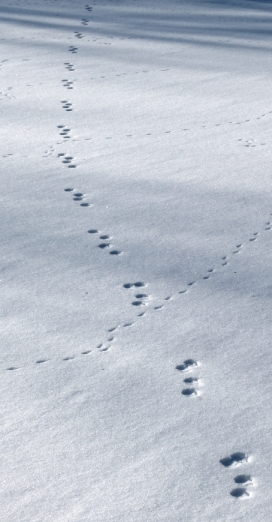
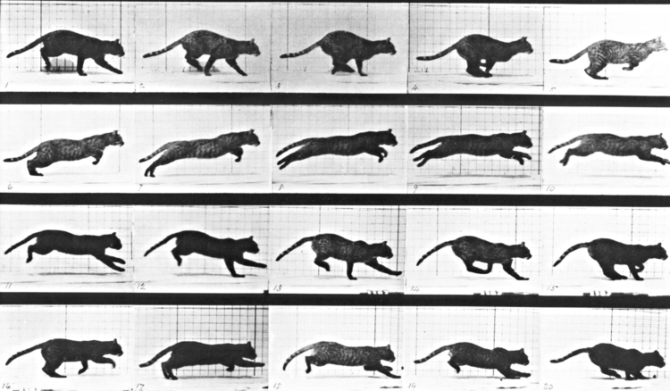

```r
setwd("c:/users/elie/box sync/teaching/AukeBay Movement/website")
render("index.html")
```

```
## Error in eval(expr, envir, enclos): could not find function "render"
```




|**Instructor** | **Teaching Assistant**|
|:------------------|:-----------------|
|[Dr. Eliezer Gurarie](https://terpconnect.umd.edu/~egurarie/) <br> [egurarie (at) umd.edu](mailto:eligurarie@umd.edu)<br> Department of Biology <br> University of Maryland | Silvia Alvarez<br>[salvarez (at) umd.edu](mailto:salvarez@umd.edu) |

|||
|--|---------------------------------------|
|**Location:** | [Ted Stevens Marine Research Institute](https://goo.gl/maps/zeqvQqWLQ5v)  <br> Large Conference Room (upstairs), Room 256|
|||
| **Times:** | Times: 8:30* - 5:00 (1 hour lunch - best to bring your own) |
| | [* - ***EXCEPT Monday, 8/22, we start at 9:00 am***].  |

## Goals

This workshop is dedicated to developing skills in animal movement analysis.  We will learn about the properties of movement data, ways to visualize and manipulate, some fundamental discrete and continuous time models of movement, tools for change point analyses, and relating movements to spatial data and environmental covariates.   

## What to bring

Bring data if you have some!  And - even more ideally - some interesting ecological or behavioral questions you are interested in exploring.  If you don't have data that feels relevant, you can work with other participants on an in-class project.

We will be using [R](https://cran.r-project.org/), which I assume most participants have expereince using.  So have that installed, preferably a recent version.  We'll also use a bunch of useful packages which we can install and load as needed.  

Bring enthusiasm! 

And - if so inclined - snacks!

## Structure

The course will mix lectures on concepts, theory and tools with practical labs using R. We will plan on covering 2 topics per day (morning and afternoon), with a lecture and an R lab each.  We will also set aside time every day for participants to apply some of the techniques to their own data (alone or in groups) in a workshop-type atmosphere.  We will culminate with some brief presentations of some of the analysis performed by individuals / groups.  

The outline of the course below is approximate.  I'll be posting links to materials (lecture and labs) as the course proceeds.  

#### Monday

##### 0. Introductions / Overview: [Lecture 0](https://terpconnect.umd.edu/~egurarie/teaching/MovementAtAukeBay/materials/Lecture0_IntroductionAndPlans.html)

##### 1. Data loading and processing 
- [Lecture 1](https://terpconnect.umd.edu/~egurarie/teaching/MovementAtAukeBay/materials/Lecture1.html#1)
- [Lecture 1 - document style](https://terpconnect.umd.edu/~egurarie/teaching/MovementAtAukeBay/materials/Lecture1_documentstyle.html)
- [Lab 1](https://terpconnect.umd.edu/~egurarie/teaching/MovementAtAukeBay/materials/Lab1_LoadingAndProcessingData.html)
- [data](https://terpconnect.umd.edu/~egurarie/teaching/MovementAtAukeBay/materials/data)
- [code](https://terpconnect.umd.edu/~egurarie/teaching/MovementAtAukeBay/materials/code)

##### 2. Visualization & descriptive statistics


#### Tuesday

##### 3. Likelihood theory as applied to movement data
##### 4. Movement models and parameters - Part I

#### Wednesday

##### 5. Movement models and parameters - Part II
##### 6. Change point analysis 

#### Thursday

##### 7. Environmental covariates - Loading and Visualizing
##### 8. Modeling covariates

#### Friday

##### 9. Overview of some advanced methods 
##### 10. Presentation of participant analyses
##### 11. Overall discussion
##### 12. Beer


<center>

</center>
