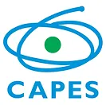
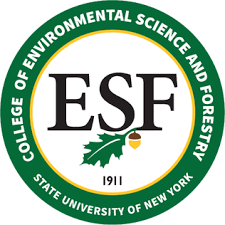

```{r, eval=FALSE, echo=FALSE}
require(rmarkdown)
render("index.rmd")
shell("index.html")
```


<center>





**[Dr. Eliezer (Elie) Gurarie](mailto:egurarie@esf.edu) | [Dr. Nicole (Nicki) Barbour](mailto:barbour@esf.edu)**

Department of Environmental Biology <br>
State University of New York, College of Environmental Science and Forestry (SUNY-ESF) <br>
Syracuse, NY 13210, USA

*With able assistance of:*<br> **Dr. Luiz Gustavo Rodrigues Oliveira-Santos** (UFMGS) and   **Dr. James Forester** (University of Minnesota)

</center>

## Goals

This workshop is dedicated to developing skills in animal movement analysis, with an aim to start with foundations and build to useful and original inference.  We will learn about the properties of movement data, how to load, explore, visualize, and manipulate movement data.  We will learn the  properties and parameters of some fundamental discrete and continuous time movement models, and how to estimate those models.  We will cover tools for segmentation, behavioral analisys, and home ranging. We will relate movements to spatial data and environmental covariates.

This is a **hands-on** course, where every day students will be expected to perform independent or group work on original problems, culminating in a final presentation of the progress made.  

## What to bring

**Bring data** if you have some!  And some **interesting ecological or behavioral questions** you are interested in exploring.  

If you don't have data that feels relevant, you can work with other participants on an in-class project.

We will be using [R](https://cran.r-project.org/), which we assume *participants have experience using*.  Be sure **R** is installed, as well as (most likely) [Rstudio](https://posit.co/download/rstudio-desktop/), preferably recent versions.  

We'll also use a bunch of useful packages which we can install and load as needed.  

Bring enthusiasm! 


## Structure

The course will mix lectures on concepts, theory and tools with practical labs using R. We will plan on covering roughly 2 topics per day in a morning (**8:00-11:30 am**) and afternoon (**1:30-5:00 pm**) session, with a mix of lecture and R labs for each.  We will also set aside time every day for participants to apply some of the techniques to their own data (alone or in groups) in a workshop-type atmosphere.  We will culminate with some brief presentations of some of the analysis performed by individuals / groups.  

The outline of the course below is approximate.  We'll be posting links to materials (lecture and labs) as the course proceeds.  


## Outline / Schedule (tentative!)

### Day 1: Monday, May 20

#### Morning: **Introductions / Overview**


- [Overview](Day1/01_Overview/Overview.html)

<font color = "darkred"> 
**Present:** *about yourself*
Please come prepared with 2-3 slides to introduce yourself, your study system, your ecological questions, and a brief description of your data. 
</font>

**Topic: Processing Movement Data**

- [Lecture Slides](Day1/02_ProcessingData/PreliminaryProcessing.html)
- [R Lab](Day1/02_ProcessingData/Lab1_DataProcessing.html)
  - data here: [Elk_GPS_data.csv](data/Elk_GPS_data.csv) (right-click to download)
  
#### Afternoon: Summarizing and Visualizing

**Topic: Visualizing Movement Data**
- [Lab](Day1/03_SummariesVisualization/Lab02_SomeVisualizations.html)

**Topic: Complex Numbers are Simple**
- [Lecture/Lab](Day1/03_SummariesVisualization/ComplexNumbers.html)

<font color = "darkred"> 
**Exercise:** *summarize and plot your data*
</font>

### Day 2: Tuesday, May 21

#### Morning: **Movement Models**

<font color = "darkred"> 
**Present:** *results from the previous day*
</font>

- Correlated random walk, discrete time, continuous time movement models
- Summary statistics and parameters

#### Afternoon: **Segmentation**

- First Passage Time
- Lavielle segmentation
- Behavioral change point analysis
- Hidden Markov models

<font color = "darkred"> 
**Exercise:** *Apply a movement model or segmentation method to your data.*
</font>

### Day 3: Wednesday, May 22

#### Morning:  **Home Range Analyses**

<font color = "darkred"> 
**Present:** *results from the previous day*
</font>

- Mininum convex polygon
- Kernel density estimates
- Auto-correlated kernel density estimates

#### Afternoon:  **Environmental Data**

- Spatial data and annotations
- Summaries of Use and Availability

<font color = "darkred"> 
**Exercise:** *Estimate a home range and/or characterize environmental space use of your organism,*
</font>

### Day 4: Thursday, May 23

#### Morning: **Resource Selection**

<font color = "darkred"> 
**Present:** results from the previous day 
</font>

- resource selection functions
- step-selection functions

#### Afternoon:  **Open Work Session**


### Day 5: Friday, May 24

#### Morning: Special Topics

By Gustavo and/or James and/or Nicki and/or Elie on selected topics of particular interest to students


#### Afternoon: **Final Presentations**

<font color = "darkred">

Please come prepared to present (~10 min) on a small analysis of your data (Include 1-2 slides each introducing your study system and research question(s), describing your methods and analyses, your results, and the implications/discussion of your findings

</font>
 
<center>

</center>
