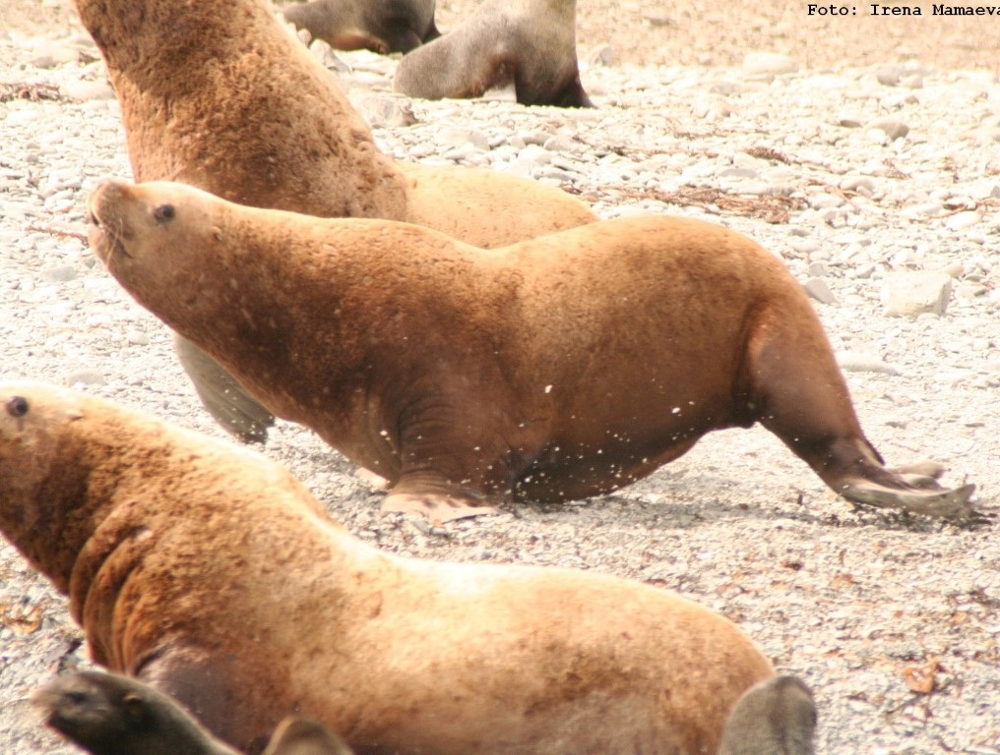
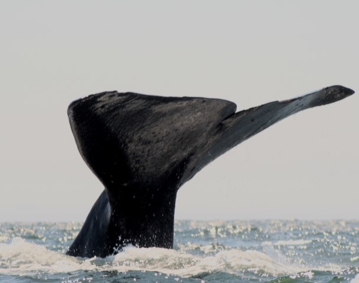
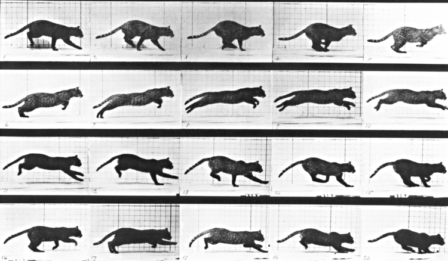
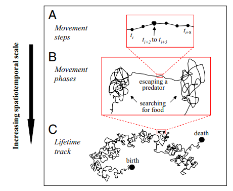
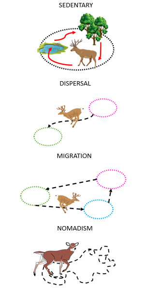

```{r setup, include=FALSE}
knitr::opts_chunk$set(echo = FALSE, message = FALSE, cache = TRUE, warning = FALSE, las = 1, dpi = 200)
#output: html_document
```

```{r colsFunction, eval = FALSE}
xaringan::inf_mr()
```


.pull-left[
### nós somos:
## Dr. Elie Gurarie


.center[
Professor - Quantitative Wildlife Ecology<br>
Dparment of Environmental Biology<br>
State University of New York - College of Environmental Science and Forestry (SUNY-ESF)
]
]
.pull-right[


.small[
*Caribou | Wolves | Steller sea lions | Northern fur seal | Pacific salmon | Sea otters | Sea lamprey | Brown bear | White-tailed deer | Fisher | Coyote | Ladoga ringed seal | Panda bear | Roe deer | Manatee | Southern three-banded  armadillo | Polar bear | Antarctic ice seals | Dall sheep | Mexican fish-eating bats | Asiatic Cheetah | Persian Leopard | Kestrel | Bowhead whales | more ...*
]
]
---

### Dr. Nicki Barbour

.pull-left[


]
.pull-right[

- **Quantitative Movement Ecologist**
- Sea Turtles
- Pronghorn
- Caribou
- Decision Making
- Impact of Roads on Movements
- R package development
]

---

## Workshop Goals
.pull-left[

### Develop skills in animal movement analysis

Roughly: 

- manipulation
- visualization & summarization
- **models of movement**
- behavioral structure / segmentation
- home ranges
- resource & step-selection

]

.pull-right-50[ 
]


---

## Structure

.pull-left[
### Somewhat improvised. But most days:

- Lecture + Lab 1
- Data Work:
  - singly or on groups
- 1.5 hour lunch
- Lecture + Lab 2
- Data Work:
  - singly or on groups
]

.pull-right[

]

---
# Presentation Schedule!
.pull-left[## Monday: Introductions

- introduce yourself
- your study system
- your ecological questions
- brief description of your data (if you have some). 

## Friday: Final Project / Presentations

5-10 minutes each! 
Throughout the week we will workshop your final projects every day. 

Also: **James** and **Gustavo** will maybe teach special lectures

]

.pull-right[


]

---

## Conceptual Framework of Movement Ecology
.pull-right-50[]


---
.pull-left-70[
## Types of movement
]

.pull-right-30[]


