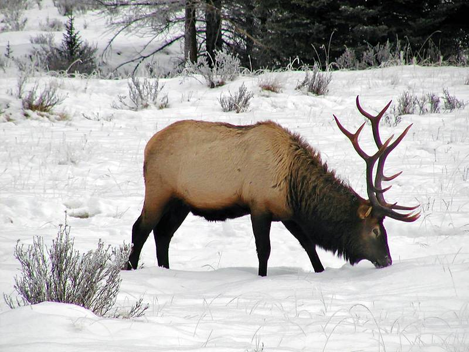

```{r setup, include=FALSE}
knitr::opts_chunk$set(echo = FALSE, message = FALSE, cache = TRUE, warning = FALSE, las = 1, dpi = 200)
#output: html_document
```

```{r colsFunction, eval = FALSE}
xaringan::inf_mr()
```

# Movement Data

.pull-left.large[
At a minimum contain three columns: 

- `X`, `Y`, `Time`

But - unless there is only one of your animal in the world - also:

- `ID`

Simple!
]

--

.pull-right.large[

**But**, in practice, there are always problems & complications.   Even with just three columns:

- `Time` - crazy complicated data formatting 
- `X` and `Y` - have to be **geo-referenced**

]

--
.center.large[
.red[Data always needs to be **processed** (cleaned up).  

Nobody enjoys this!  It is **tedious** and **time-consuming**.  

But also very important.]
]

---

## Principles of data processing

### Smart data processing is:

- **compartamentalized** - e.g. each step a function

- **interactive** - use visualization and interactive tools

- **generalizable** - to apply to multiple individuals / multiple populations

- **replicable** - *important: NEVER overwrite the raw data!*

- **well-documented** - so you don't have to remember what you did

- **forgettable!** - so once its done you don't need to think about it any more


---

##  Some Tools

Several packages and `Rtools` particularly useful for data processing and clean-up:

- `plyr` - manipulating data frames and lists
 - functions: `mutate()`; `ddply()`-`ldply()`-`dlply()`

- `lubridate` - manipulating time objects

- `sf` - projecting coordinates

- `maps` and `mapdata` - quick and easy maps

- `magrittr` (or - now - the **native pipe**).


---

##  Also movebank!

Movebank 

---

##  Some Data 

.pull-left[

### Elk (*Cervus elaphus*)


]

.pull-right[
near Banff National Park 


]
