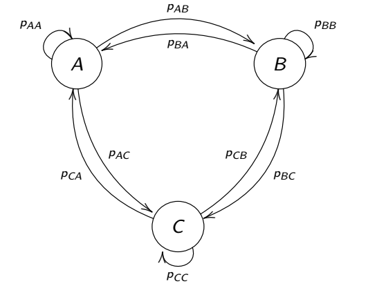

```{r, include = FALSE}
require(knitr)
opts_chunk$set(cache=TRUE, dpi=100, fig.height=4, fig.width = 6, message = FALSE, warning = FALSE)
```


```{r, echo = FALSE, message = FALSE}
require(elieslides)
require(marcher)
require(circular)
scantrack <-  function(Z, ...){
  scan_track(data.frame(T = 1:length(Z), X = Re(Z), Y = Im(Z)), ...)
}
```


## 1D Random Walk


$$X \sim \text{RW}_{1d}(\sigma)$$

$$X_t = X_{t+1} + \sigma W_t$$
where $W_t \sim {\cal N}(0,1)$ = white noise

```{r, echo = TRUE}
sigma = 2
Z <- cumsum(rnorm(100, sd = sigma))
```

```{r, echo = FALSE, fig.height = 3}
pars()
plot(1:length(Z), Z, type = "o", xlab = "time")
```


### Properties

$$\text{E}(Z_t) = 0$$
$$\text{Var}(Z_t) = \sigma^2 t$$
On *average* goes nowhere, over time goes to $\infty$ (unconstrained)


## 2D Random Walk

$${\bf Z} \sim \text{RW}_{2d}(\sigma)$$ 
$${\bf Z}_t = {\bf Z}_{t-1} + \sigma{\bf W}_t$$

boldfacing means 2-d vector, but will drop going forward.

```{r, echo = TRUE}
sigma <- 3; n <- 100
Z <- cumsum(rnorm(n, sd = sigma)) + 
  1i*cumsum(rnorm(n, sd = sigma))
```

```{r, echo = FALSE, fig.height = 4}
pars()
scantrack(Z, cex = 1)
```


### Properties

$$\text{E}({\bf Z}_t) = \{0,0\};\,\, \text{Var}(|{\bf Z}_t|) = 2 \sigma^2 t$$
Step & turning angles:

$$\theta \sim \text{Unif}(-\pi, \pi)$$


$${|\bf S| / \sigma} \sim \text{Chi}(k = 2); \,\,  \text{E}({|\bf S|}) = \sqrt{2}\sigma$$

You can use this result to estimate $\sigma$ - just take the mean step lengths and divide by $\sqrt{2}$

```{r RW_CRW, echo = FALSE, fig.height = 4}
n <- 1000
sd <- 3
Z <- cumsum(rnorm(n, sd = sd)) + 1i*cumsum(rnorm(n, sd = sd))
S <- Mod(diff(Z))
par(mfrow = c(1,2))
hist(S/sd, breaks = 40, freq = FALSE, bor = "darkgrey")
#curve(chi::dchi(x,2), add = TRUE, col = "red", lwd = 2)
rose.diag(diff(Mod(diff(Z))), bins = 24, 
          prop = 2, col = "grey", bor = "darkgrey", 
          main = expression("turning angle"~theta))

```

## 1D Auto-regression process

$$X \sim \text{AR}_{1d}(\phi, \sigma)$$

$$X_t = \phi X_{t+1} +\sigma W_t$$
```{r, echo = TRUE}
sigma = 2; phi = 0.8; n = 100; 
X <- c(rnorm(1,0,sigma), rep(NA, n-1))
for(i in 2:n)
  X[i] <- phi*X[i-1] + rnorm(1,0,sigma)
```

By the way: start making functions!

```{r, echo = TRUE}
AR1D <- function(n = 100, sigma = 2, phi = 0.8, mu = 0){
  X <- c(rnorm(1,0,sigma), rep(NA, n-1))
  for(i in 2:n)
    X[i] <- phi*X[i-1] + rnorm(1,0,sigma)
  X + mu
}
```

```{r, echo = FALSE, fig.height = 3}
pars()
plot(1:length(X), X, type = "o", xlab = "time")
```

### Properties

$$\text{E}(X_t) = 0$$
$$\text{Var}(X_t) = {\sigma^2 \over 1-\phi^2}  $$
(Auto)-regresses to mean (easily rescaled to $\mu \neq 0$). 

Spatially constrained! 

## 2D autoregressive walk

$${\bf Z} \sim \text{AR}_{2d}(\phi, \sigma)$$
$${\bf Z}_t = \phi {\bf Z}_{t-1} + \sigma {\bf W}_t$$

Where everything is 2D.  And easily scaled to a different mean $\bf m$

```{r, echo = TRUE, fig.height = 3}
AR2D <- function(n = 100, phi = 0, sigma = 1, mu = 0){
  X <- AR1D(n, sigma, phi, Re(mu))
  Y <- AR1D(n, sigma, phi, Im(mu))
  X + 1i*Y
}
```

```{r, fig.height = 4}
scantrack(AR2D(100, 0.8, 1, 10+1i*5), cex = 1)
```


### Properties

Spatially constrained in 2D!  

Actually looks kind of like home ranging. 
In fact, the 95% home-ranging area is:

$$A \approx {6 \pi \sigma^2 \over 1 - \phi^2 }$$
(Where $6 \approx -2\log(\alpha)$, $\alpha = 5\%$)

Rewrite in terms of "steps" (displacements):

$${\bf Z}_t = {\bf Z}_{t-1} - (1-\phi){\bf Z}_{t-1} + \sigma {\bf W}_t$$
$${\bf S}_t = - (1-\phi){\bf Z}_{t-1} + \sigma {\bf W}_t$$

This means that the *step* process itself is NOT stationary / independent, but depends on **absolute location**.  

Specifically, the urge to "go home" is proportional to the distance from home. 

And, of course, there is auto-correlation in the locations:

```{r, fig.height = 2.5, echo  = -1}
pars()
Z <- AR2D(100, 0.8, 1, 10+1i*5)
acf(Re(Z))
```

But NOT in the steps themselves:

```{r, fig.height = 2.5, echo  = -1}
pars()
acf(Re(diff(Z)))
```

## Correlated Random Walk

Basically:  

$$Z_t = Z_{t-1} + S_t$$

- $\theta = \text{Arg}(S) \sim \text{some distribution}$
- $|S| \sim \text{some distribution}$

> **The famous one:**

]


> **The totally forgotten one:**


```{r echo = TRUE}
require(circular)

CRW <- function(n = 100, rho=0.8, alpha = 1, beta = 2){
  theta <- rwrappedcauchy(n, rho)
  phi  <- cumsum(theta)
  S <- complex(arg = phi, mod = rweibull(n, alpha, beta))
  cumsum(S)
}
```

```{r, fig.height = 4}
pars()
scantrack(CRW())
```

Also - flies off to infinity.  

Also - autocorrelated in position:

```{r, fig.height=3, echo = -1}
pars()
acf(Re(Z))
```

but not in steps!

```{r, fig.height=3, echo = -1}
pars()
acf(Re(diff(Z)))
```

(So is it really a *correlated* random walk?)
]

## Multi-state Correlated Random Walk


Pretty self-explanatory!  

> **BUT** ... what is the model of transitioning between these states? 
> 


## Digression on Markov Chains

(***This should really be its own chapter!***)

Consider ${\bf X} = \{X_1,X_2,X_3, ... , X_n\}$ is in some discrete **state space** $\mathcal{E}$ (here: $A, B, C$) with fixed probabilities of transitioning from one state to another:

Sample sequence: ${\bf X} = CCCBBCACCBABCBA ...$.

This is called a **Markov chain**.




### Markov property
	
${\bf X}_n$ has the **Markov Property** if: 
$$\Pr [X_n=x_n|x_1,x_2,x_3 ... x_{n-1}] = \Pr[ X_n = x_n| x_{n-1}]$$
In other words, any system whose future depends .darkgreen[**only on the present**] and .darkred[**not on the past**] has the *Markov Property* and any sequence of events with the Markov property is a **Markov Chain**. 

- The $p_{ij}(t)$'s of a Markov chain are **transition probabilities**. 

- If $p_{ij}(t)$'s are time invariant, i.e. $p_{ij}(t) = p_{ij}$, the chain is called **time homogeneous** or **stationary**.


### Probability transition matrix

We express this process in terms of a **Probability Transition** matrix:
	


Such that: 
	$$M_{ij}=\Pr{(X_{t+1} = j | X_t = i)} = p_{ij}$$
Note that: 
  $$\sum_{j=1}^{n} p_{ij} = 1  \ldots \text{BUT} \ldots \sum_{i=1}^{n} p_{ij} \neq 1$$

Such that: 
	$$\Pr{(X_{t+1} = j)} = \sum_{i=1}^N M_{ij} \Pr{(X_t = i)}$$
Which can be conveniently rewritten in matrix notation as: 
	$$\pi_{t+1} = {\bf M} \times (\pi_{t})^T$$
		
Where $\pi_t$ is the distribution of the system over all states at time $t$. 

### Example 1: Children play frisbee

```{r FrisbeeKids, echo=FALSE, fig.height = 4, fig.width = 4}
require(igraph)
M <- rbind(c(0,3/4,0,1/4), c(0,0,1/4,3/4), c(1/3,1/3,0,1/3), c(0,0,1,0))
names <- c("Alice", "Boris", "Cheng", "Ditya")
rownames(M) <- names
colnames(M) <- names
M.names <- as.vector(t(M)[t(M)!=0])
M.names <-c("3/4", "1/4", "1/4", "3/4", "1/3", "1/3", "1/3", "1")

M.graph <- graph.adjacency(M, add.rownames=TRUE, weighted=TRUE)
par(mar=c(0,0,0,0), oma=c(0,0,0,0))
plot.igraph(M.graph, vertex.size=60, vertex.shape = "crectangle", 
            vertex.label.font = 2, vertex.label.cex = 1.5, 
            edge.curved=-.3, edge.label=M.names, edge.color="darkgrey",
            layout = cbind(c(0,-1.5,1.5,0), c(1,0,0,-1)))
```

$$\large{\bf M}= \begin{array}{c|cccc|}
  			&	A & B & C & D\\
\hline		
	A & 0	&3/4&	0 & 1/4\\
	B &0	& 0	&	1/4 & 3/4\\
	C &1/3 & 1/3 & 0	& 1/3\\
	D &0	&	0& 1 & 0 
		\end{array}$$


Let's give the frisbee to Alice, and see what happens:

```{r, echo = TRUE}
M <- rbind(c(0,3/4,0,1/4), c(0,0,1/4,3/4), c(1/3,1/3,0,1/3), c(0,0,1,0))
rownames(M) <- c("Alice", "Boris", "Cheng", "Ditya")
colnames(M) <- rownames(M)
rowSums(M)
State<-1:4
X <- 1
Xs <- X
for(i in 1:30){
	X<-sample(State,1,prob=M[X,])  
	Xs <- c(Xs, X)
}
paste(LETTERS[Xs], collapse="-")
```

This is called a **realization** of a stochastic process.

Let us consider this process *probabilistically*.  Again, we start with Alice (click below to animate - pay attention to the probabilities )			
			
```{r FrisbeeAnimation, fig.show='animate', echo = FALSE, fig.height = 4, aniopts="controls,loop"}
	PA <- c(0,3/4,0,1/4)
	PB <- c(0,0,1/4,3/4)
	PC <- c(1/3,1/3,0,1/3)
	PD <- c(0,0,1,0)
 
# Make Matrix
	
	M <- rbind(PA,PB,PC,PD)
	X <- c(1,0,0,0)
	i<-0
	Xs<-paste(c("pi_", i , "=",  paste(round(X,3),",")),sep="")
	mycols <- c("purple", "forestgreen", "lightblue", "antiquewhite")
	
	for(i in 1:20){
		barplot(as.vector(X), width=0.8, main=i, col=mycols, ylim=c(0,1), las = 1)
		labs <- paste("pi[", LETTERS[1:4], "]==", round(X,3), sep="")
		for(j in 1:4)
			eval(parse(text = paste0("mtext(side = 3, at = ", j-.5, ", expression(", labs[j], "))")))
		X <- X %*% M
	}
	paste("pi_", i , "=",  paste(round(X,3), collapse = ","))
```

The state: $\pi^* =  (0.12 ,  0.21 ,  0.361 , 0.308)$ is referred to as **stationary**.  

1.  The name can be a bit confusing: the frisbee is not stationary, it is always moving around. 
2.  All states have a  finite probablity (0 to 1) of being revisited forever and ever until the children's arms fall off.  Such states are termed **recurrent**, **persistent** or **ergodic**.
3. The state can be solved for mathematically: 
	$$\pi^* = {\bf M} \times (\pi^*)^T$$

This is often quite easy to obtain.  

For example, via brute force matrix multiplication:

```{r PowerMatFunction, size = "scriptsize", echo = TRUE}
powermat=function(M,t){
  Mt <- M
  for(i in 2:t) Mt = Mt %*% M
  Mt}
powermat(M,100)
```

Or via matrix algebra:

```{r SolveForPi, size = "scriptsize", echo = TRUE}
 n <- nrow(M)
 a <- rbind((t(M) - diag(n))[-n,], rep(1,n))
 b <- c(rep(0,n-1),1)
 solve(a, b)
```

*Think about why does this works ...*

## Back to Multi-state CRW ... 

To simulate a multi-state CRW, first create a transition matrix:

```{r}
M <- rbind(c(0.7,0.2,.1), c(.4,.4,.2), c(0,0.8,0.2))
row.names(M) <- colnames(M) <- c("chilling", "cruising", "huffing")
M
```

Create a vector of simulated states:

```{r, echo = TRUE}
n <- 400
states <- 1:nrow(M)
State <- c(1, rep(NA, n=1))
for(i in 2:n)
  State[i] <- sample(states, 1, prob=M[State[i-1],])  
State[1:100]
```

```{r, fig.height = 1, echo = FALSE}
pars(); par(mar = c(2,0,0,0), mgp = c(.5,0,0))
image(State %>% t %>% t, col = c("blue","green","orange"), xaxt = "n", xlab = "time")
```

Next, assign movement steps to each state

```{r echo = TRUE}
rhos <- c(0, .5, .9)
betas <- c(.5,3,8)
alphas <- c(1,2,5)

rwc <- function (n, mu, rho) {
  ifelse(rho == 0, 
      runif(length(rho == 0), 0, 2*pi), 
        rcauchy(n, mu, -log(rho)) %% (2 * pi))
}

thetas <- rwc(n, mu= 0, rho = rhos[State])
step_lengths <- rweibull(n, shape = alphas[State], scale = betas[State])

S <- complex(arg = cumsum(thetas), mod = step_lengths)
Z <- cumsum(S)
```

```{r MRW_sim_plot, echo = -1}
pars(); set.seed(1)
cols <-  c("darkblue","green","orange")
plot(Z, type = "l", col = "darkgrey", asp = 1)
points(Z, col = cols[State], pch = 19, cex = 0.5)
legend("topright", legend = row.names(M), col = cols, pch = 19)
```

Stationary state proportions: 

```{r, echo = FALSE}
n <- nrow(M)
a <- rbind((t(M) - diag(n))[-n,], rep(1,n))
b <- c(rep(0,n-1),1)
solve(a, b)
```

Simulated proportions:

```{r}
table(State) |> prop.table()
```

## Habitat dependent Multi-state random walk

The actual Morales MRW was more interesting than just transitions ... each transition was modeled as **depending on covariates** ($\bf X$) according to coefficients $\beta$.  

$$p_{12} = {e^{\beta {\bf X}} \over 1 + e^{\beta {\bf X}}}$$

and $p_{11} = 1-p_{12}$.   This sounds crazy complicated, but - with recent technology is - in fact - quite easy to do!  (later this week)

